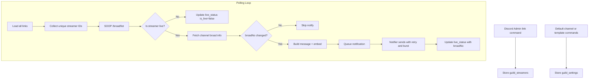

# SoupNotify

<p align="center">
  
</p>

<p align="center">
  
  
  
  
</p>

Get notified when your favorite streamers go live on SOOP. Fast, reliable alerts with easy setup.

## Overview

- Multi-server support with per-guild configuration.
- Notifies once per live session (tracks `broadNo` to avoid spam).
- Discord embeds with title, category, viewers, and thumbnail.
- Postgres or SQLite storage, FastAPI health endpoints, and a built-in send queue.

## Architecture

- **Discord bot**: Slash commands, admin-only safeguards, and optional sharding.
- **SOOP polling**: Polls `/broad/list` and verifies live sessions via `broadNo`.
- **Storage**: Postgres (recommended) or SQLite for local dev.
- **Notifier**: In-process queue with burst mode and retry/backoff.
- **API**: FastAPI health endpoints (`/`, `/healthz`, `/readyz`).

## Quick Start (local)

### Discord Bot Setup (one-time)

1) Go to the Discord Developer Portal and create a new application.
2) In **Bot**:
   - Click **Add Bot**.
   - Copy **Bot Token** and **Application ID**.
3) In **OAuth2 → URL Generator**:
   - Scopes: `bot`, `applications.commands`
   - Bot Permissions: **View Channels**, **Send Messages**, **Read Message History**
4) Use the generated invite URL to add the bot to your server.

1) Create and fill `.env` (see Configuration).
   - You can start from `.env.example`.
2) Install dependencies and run:

```bash
uv sync
uv run uvicorn soupnotify.app.main:app --host 0.0.0.0 --port 8000
```

3) Start the Discord bot worker (requires Discord env vars):

```bash
uv run python -m soupnotify.bot
```
> Live detection uses `/broad/list` and matches `user_id` values. Adjust parsing in `soupnotify/soop/client.py` if needed.

## Configuration

Minimum env values for API only (Postgres via docker-compose):

```
SOOP_API_BASE_URL=https://openapi.sooplive.co.kr
SOOP_CLIENT_ID=your_soop_client_id
DATABASE_URL=postgresql+psycopg://root:change_me@db:5432/soupnotify
```

You can also run SQLite locally:

```
DATABASE_URL=sqlite:///soop.db
```

Additional required env values to run the bot:

```
DISCORD_TOKEN=your_bot_token
DISCORD_APPLICATION_ID=your_app_id
```

| Variable | Description | Required |
| --- | --- | --- |
| DISCORD_TOKEN | Discord bot token | Yes |
| DISCORD_APPLICATION_ID | Discord application ID | Yes |
| DISCORD_GUILD_ID | Dev-only: enable instant slash command sync | No |
| SOOP_API_BASE_URL | SOOP API base URL | Yes |
| SOOP_CLIENT_ID | SOOP OpenAPI client_id | Yes |
| SOOP_CHANNEL_API_BASE_URL | Channel API base URL (single streamer) | No |
| SOOP_HARDCODE_STREAMER_ID | Force-check one streamer via channel API | No |
| SOOP_STREAM_URL_BASE | Base URL for streamer pages | No |
| SOOP_THUMBNAIL_URL_TEMPLATE | Thumbnail template (uses {broad_no}) | No |
| NOTIFY_CHANNEL_ID | Default Discord channel for notifications | No |
| DATABASE_URL | Database connection string | Yes |
| POLL_INTERVAL_SECONDS | Polling interval in seconds | No |
| SOOP_MAX_PAGES | Max pages to scan per poll | No |
| SOOP_RETRY_MAX | SOOP request retry attempts | No |
| SOOP_RETRY_BACKOFF | Base seconds for retry backoff | No |
| NOTIFY_RATE_PER_SECOND | Max notification send rate | No |
| NOTIFY_BURST_RATE_PER_SECOND | Burst send rate when queue is large | No |
| NOTIFY_BURST_THRESHOLD | Queue size that triggers burst mode | No |
| SHARD_COUNT | Discord shard count (scale) | No |
| LOG_LEVEL | Logging level (info, debug) | No |

SOOP API docs (reference):

```
https://openapi.sooplive.co.kr/apidoc#broadcast-filtering-registrationmodificationpost
```

Live detection currently uses the `/broad/list` endpoint and matches `user_id` against linked streamers.

## Discord Commands

- `/link soop_channel:<id> [notify_channel:<#channel>]` (uses default if set)
- `/unlink soop_channel:<id>`
- `/unlink_all`
- `/status` (lists linked streamers)
- `/test [soop_channel:<id>]`
- `/template action:<set|clear|list> soop_channel:<id> message_template:<text>`
- `/embed_template action:<set|clear|show> title:<text> description:<text> color:<hex>`
- `/default_channel action:<set|clear> channel:<#channel>`
- `/link_list [page:<n>]`
- `/config`
- `/metrics`
- `/help`
- `/debug_live_status`

Template variables:

- `{soop_channel_id}`
- `{soop_url}` (e.g. `https://play.sooplive.co.kr/<id>`)
- `{notify_channel}`
- `{guild}`

Embed template supports the same variables for title/description.

Notifications include a Discord embed (title, category, viewers) when SOOP channel info is available.
Embed image is built from `SOOP_THUMBNAIL_URL_TEMPLATE` using the `broadNo` value.

Admin-only commands: `/link`, `/unlink`, `/unlink_all`, `/template set/clear`, `/default_channel`, `/config`, `/metrics`.

Live notifications are de-duplicated per streamer using the latest `broadNo` so restarts do not spam.

## Logic Flow



## Deployment (Docker)

Build the container:

```bash
docker build -t soupnotify:latest .
```

Run with environment variables:

```bash
docker run --rm -p 8000:8000 \
  --env-file .env \
  soupnotify:latest
```

For production, run the bot and API as separate processes (recommended):

- **API**: `uv run uvicorn soupnotify.app.main:app --host 0.0.0.0 --port 8000`
- **Bot worker**: `uv run python -m soupnotify.bot`

### Docker Compose (recommended)

```bash
docker compose up --build
```

The compose file runs two services (api + bot) plus Postgres, and validates required env vars on startup.

## Migrations

Run database migrations with Alembic (Postgres or SQLite). The app requires migrations before startup:

```bash
uv run alembic upgrade head
```

### Postgres (Docker) migration guide

1) Start only the database:

```bash
docker compose up -d db
```

2) Install dependencies (includes Postgres driver):

```bash
uv sync
```

3) Run migrations against the Postgres container:

```bash
docker compose exec api uv run alembic upgrade head
```

4) Optional: run API + bot after migrations:

```bash
docker compose up --build
```

### Generating a Postgres password

Use a strong password and update both `.env` and `docker-compose.yml`.

Example (generate 24 random characters):

```bash
python -c "import secrets; print(secrets.token_urlsafe(24))"
```

Then set:

```
POSTGRES_PASSWORD=your_generated_password
DATABASE_URL=postgresql+psycopg://root:your_generated_password@db:5432/soupnotify
```

## Tests

```bash
uv run pytest
```

## Contributing

See `CONTRIBUTING.md`.

## License

MIT. See `LICENSE`.
